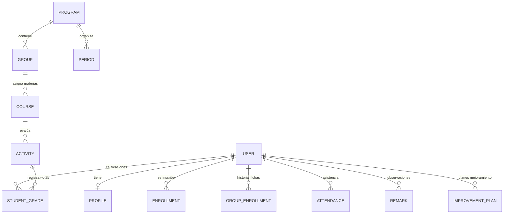

# Documentación Completa de AcademiX V2

AcademiX V2 es una plataforma integral de gestión académica, control de asistencia, seguimiento conductual (observador digital), calificaciones jerárquicas y planificación horaria, diseñada específicamente para centros de formación técnica y profesional (alineada con el modelo educativo del **SENA - Servicio Nacional de Aprendizaje** de Colombia).

La plataforma conecta en tiempo real a cuatro actores principales: **Administradores**, **Gestores Académicos**, **Instructores (Docentes)** y **Aprendices (Estudiantes)**, permitiendo automatizar los procesos de programación horaria, evaluación jerárquica y analítica del rendimiento académico.

---

## Índice
1. [Arquitectura y Roles de Usuario](#1-arquitectura-y-roles-de-usuario)
2. [Módulo de Gestión Académica y Usuarios (Administrador)](#2-módulo-de-gestión-académica-y-usuarios-administrador)
3. [Módulo de Gestión para Coordinación y Gestores Académicos](#3-módulo-de-gestión-para-coordinación-y-gestores-académicos)
4. [Módulo de Planificación y Gestión Horaria Anticolisión](#4-módulo-de-planificación-y-gestión-horaria-anticolisión)
5. [Módulo del Instructor (Gestión de Fichas)](#5-módulo-del-instructor-gestión-de-fichas)
6. [Módulo del Aprendiz (Portal de Estudiante)](#6-módulo-del-aprendiz-portal-de-estudiante)
7. [Módulo de Ambientes de Formación e Infraestructura](#7-módulo-de-ambientes-de-formación-e-infraestructura)
8. [Configuración Global y Personalización del Sistema](#8-configuración-global-y-personalización-del-sistema)
9. [Modelo de Base de Datos (Esquema Prisma V2)](#9-modelo-de-base-de-datos-esquema-prisma-v2)
10. [CLI y Scripts de Administración](#10-cli-y-scripts-de-administración)

---

## 1. Arquitectura y Roles de Usuario

La plataforma implementa un control de acceso basado en roles (RBAC) con una arquitectura de menú lateral (`AppSidebar`) optimizada. En el modelo formativo del **SENA**, el **Gestor Académico** es el **coordinador operativo principal** que ejecuta la mayor parte del flujo académico, mientras que el **Administrador** gestiona el equipo directivo y la configuración global del sistema.

---

### 📂 1.1. Gestor Académico (`gestor`) — Coordinador Académico Principal
*   **Propósito:** Es el **actor operativo central** del sistema. Coordina y ejecuta la gestión completa de los Programas de Formación a su cargo (`managedPrograms`), incluyendo aprendices, instructores, fichas, competencias, ambientes y mallas horarias.
*   **📌 Estructura del Menú Lateral (Sidebar):**
    1.  **`Inicio` (`/dashboard/gestor?programId=...`):**
        *   Panel de monitoreo y salud académica del Programa de Formación seleccionado.
        *   KPIs en tiempo real: Aprendices matriculados, Fichas activas, Competencias y Docentes vinculados.
        *   Filtro interactivo para alternar entre los diferentes programas coordinados.
    2.  **`Gestión de Usuarios` (`/dashboard/gestor/users?programId=...`):**
        *   **Módulo Central de Operación de Aprendices y Docentes (`UnifiedUserManagement.tsx`):**
        *   **Selección por Ficha:** Selector dinámico por pills de Fichas (`Todas`, `3410947`, `3491237`, etc.).
        *   **Gestión de Estudiantes:** Filtros por Etapa (Lectiva / Productiva), alta manual, edición, traslados entre fichas e importación masiva desde planillas de Excel.
        *   **Analítica de Grupo:** Acceso directo al panel estadístico del grupo.
        *   **Seguimiento a Planes de Mejoramiento:** Control de compromisos académicos de los aprendices.
        *   **Gestión de Instructores:** Directorio de docentes vinculados al programa.
    3.  **`Estructura Curricular` (`/dashboard/gestor/courses?programId=...`):**
        *   Módulo completo de administración curricular (`AcademicManagement.tsx`):
        *   **Trimestres / Periodos:** Estructuración y ordenamiento de las fases de formación.
        *   **Competencias / Materias:** Creación de materias, horas semanales y enlaces de apoyo.
        *   **Fichas / Grupos de Caracterización:** Fechas de inicio/fin, jornadas lectivas y tutores.
        *   **Ambientes de Formación:** Asignación de aulas físicas, laboratorios, aforo y recursos.
        *   **Cualificación Docente:** Registro de instructores autorizados para imparte cada competencia.
    4.  **`Programación Horaria` (`/dashboard/gestor/schedules?programId=...`):**
        *   Motor de planificación horaria anticolisión (`SchedulePlanning.tsx`):
        *   Creación, edición y publicación de mallas horarias de las fichas.
        *   Validación en tiempo real de disponibilidad del docente, aforo de aula y topes semanales.
        *   Registro de festivos y novedades de horario.

---

### 👑 1.2. Administrador (`admin`) — Gestión Institucional y Directiva
*   **Propósito:** Gestión directiva del sistema, control de usuarios administrativos y personalización global del centro de formación.
*   **📌 Estructura del Menú Lateral (Sidebar):**
    1.  **`Inicio` (`/dashboard/admin`):** Dashboard institucional global con métricas consolidadas del centro (administradores, gestores, programas, docentes y aprendices).
    2.  **`Gestión de Usuarios` (`/dashboard/admin/users`):**
        *   Administración del **Equipo de Administración y Gestión** (`AdminUsersManagement.tsx`):
        *   **Administradores:** Alta y control de cuentas directivas.
        *   **Gestores Académicos:** Alta de gestores y asignación/desasignación de Programas de Formación bajo su responsabilidad (`managedPrograms`).
        *   **Suplantación de Sesión Segura (*Impersonation*):** Inicia sesión en tiempo real como cualquier usuario para soporte remoto inmediato.
        *   **Seguridad:** Reseteo de claves, eliminación y suspensión (`banned`).
    3.  **`Programas de Formación` (`/dashboard/admin/courses`):** Vista de supervisión global de programas de formación y mallas curriculares.
    4.  **`Configuración` (`/dashboard/admin/settings`):** Personalización institucional (`SystemSettings.tsx`): Logotipos, favicons, imagen Hero, temas HSL, editor de código y parámetros operativos.

---

### 👨‍🏫 1.3. Instructor / Docente (`teacher`) — Formador de Aula
*   **Propósito:** Gestión pedagógica diaria de las Fichas asignadas.
*   **📌 Estructura del Menú Lateral (Sidebar):**
    1.  **`Inicio` (`/dashboard`):** Clases del día y agenda de formación.
    2.  **`Gestión de Usuarios` / `Gestión de Fichas` (`/dashboard/teacher`):** Consola por Ficha (`GroupManager.tsx`) con planilla de asistencia matricial responsiva (`touch-pan-x`), observador digital (`viewedAt`), calificaciones ponderadas a Excel, planes de mejoramiento, material compartido y ruleta (`Roulette.tsx`).
    3.  **`Programación Horaria` (`/dashboard/teacher/schedule`):** Horario de clases y declaración de disponibilidad semanal.

---

### 🎓 1.4. Aprendiz / Estudiante (`student`) — Portal de Formación
*   **Propósito:** Consulta y autocontrol del proceso formativo.
*   **📌 Estructura del Menú Lateral (Sidebar):**
    1.  **`Inicio` (`/dashboard`):** Dashboard real-time con % Asistencia, Ficha, Promedio de Notas y agenda diaria.
    2.  **`Registro Académico` (`/dashboard/student/records`):** Expediente full-width (`w-full max-w-full`), justificación digital de inasistencias, firma de planes de mejoramiento y boletines.
    3.  **`Programación Horaria` (`/dashboard/student/schedule`):** Agenda de clases semanal/mensual.

---

## 2. Módulo de Gestión Académica y Usuarios (Administrador)

Este módulo (implementado en [AcademicManagement.tsx](file:///c:/Users/Jhon/Documents/Datos/Informacion/2026/Proyectos/AcademixV2/src/features/admin/components/AcademicManagement.tsx) y [UnifiedUserManagement.tsx](file:///c:/Users/Jhon/Documents/Datos/Informacion/2026/Proyectos/AcademixV2/src/features/admin/components/UnifiedUserManagement.tsx)) constituye la base administrativa del sistema:

*   **Gestión Unificada de Usuarios (`UnifiedUserManagement.tsx`):**
    *   Administración centralizada de Administradores, Gestores, Instructores y Aprendices.
    *   **Creación y Edición Rápida:** Registro individual con autocompletado de perfiles (documento, nombres, apellidos, teléfono).
    *   **Carga Masiva en Excel:** Importación de listas de aprendices desde plantillas de Excel con validación previa de correos e identificaciones.
    *   **Suplantación de Sesión Segura (*Impersonation*):** Permite al administrador acceder a la plataforma como cualquier usuario para soporte en tiempo real sin requerir su contraseña, con trazabilidad de auditoría.
    *   **Suspensión y Bloqueo (`banned`):** Inhabilitación de accesos temporales o definitivos especificando el motivo del bloqueo.
*   **Periodos y Materias:**
    *   Estructuración de divisiones temporales (trimestres o periodos específicos) por programa de formación.
    *   Administración de **Materias / Competencias**: creación de cursos con horas semanales sugeridas, URL de apoyo (Classroom/Moodle), badges de color e íconos temáticos.
*   **Grupos y Fichas de Formación:**
    *   Creación y edición de Fichas de caracterización con fechas de inicio/fin y jornada lectiva.
    *   Reubicación ágil de aprendices entre fichas e historial de traslados (`GroupEnrollment`).
*   **Instructores:**
    *   Asignación de competencias que cada docente está calificado para impartir (`qualifiedCourses`).
    *   Configuración de límites de carga horaria semanal y bloqueo de disponibilidad.

---

## 3. Módulo de Gestión para Coordinación y Gestores Académicos

Módulo dedicado a la supervisión académica descentralizada por programa de formación:

*   **Alcance Delimitado (`managedPrograms`):** El gestor solo tiene acceso a las fichas, materias, instructores y aprendices pertenecientes a los programas que le han sido asignados.
*   **Monitoreo Institucional:** Métricas de cobertura horaria, cumplimiento de clases y seguimiento a novedades reportadas por los instructores.

---

## 4. Módulo de Planificación y Gestión Horaria Anticolisión

Motor de generación de horarios académicos (implementado en [SchedulePlanning.tsx](file:///c:/Users/Jhon/Documents/Datos/Informacion/2026/Proyectos/AcademixV2/src/features/admin/components/SchedulePlanning.tsx) y [CalendarGroupGrid.tsx](file:///c:/Users/Jhon/Documents/Datos/Informacion/2026/Proyectos/AcademixV2/src/features/admin/components/CalendarGroupGrid.tsx)):

*   **Planificador Interactivo Grid:** Visualización estructurada por Ficha de lunes a domingo con bloques horarios drag-and-drop o asignación asistida.
*   **Detección de Colisiones en Tiempo Real:**
    1.  **Colisión del Instructor:** Evita asignar un docente a dos clases simultáneas.
    2.  **Colisión de Ambiente:** Impide la sobreasignación de aulas físicas o laboratorios.
    3.  **Límites de Carga y Disponibilidad:** Controla la intensidad máxima semanal del docente y los límites diarios del aprendiz.
*   **Publicación Jerárquica:** Los horarios se conservan en estado **Borrador** hasta su validación y publicación definitiva.
*   **Novedades y Eventos (`ScheduleNovelty` / `ScheduleEvent`):** Registro de festivos o ausencias programadas que suspenden la contabilización horaria.

---

## 5. Módulo del Instructor (Gestión de Fichas)

Es la consola de trabajo diaria del docente (implementada en [GroupManager.tsx](file:///c:/Users/Jhon/Documents/Datos/Informacion/2026/Proyectos/AcademixV2/src/features/teacher/components/GroupManager.tsx)):

*   **A. Directorio y Fichas de Aprendices:** Vista completa de estudiantes con foto, datos de contacto, novedad (`StudentNovedadBadge`) y acumulado de asistencias.
*   **B. Planilla de Asistencia Matricial Responsiva:**
    *   **Control Diario:** Marcación de estados: **Presente (`PRESENT`)**, **Ausente (`ABSENT`)**, **Tarde (`LATE`)**, **Retiro Temprano (`LEAVE_EARLY`)** y **Excusa (`EXCUSED`)**.
    *   **Desplazamiento Táctil Completo (`touch-pan-x`):** En dispositivos móviles, la tabla permite scroll horizontal fluido de todas las columnas (fechas y totales `F / T / R`).
    *   **Permisos Extemporáneos:** Formulario de solicitud al administrador para modificar asistencias de semanas anteriores cerradas.
*   **C. Observador Digital (Bitácora Conductual):**
    *   Anotaciones formativas (`ATTENTION`, `COMMENDATION`, `CITATION`, `OTHER`) con uso de plantillas (`RemarkTemplate`).
    *   **Acuse de Recibo:** Registro con marca temporal (`viewedAt`) cuando el estudiante visualiza la observación.
*   **D. Calificaciones Ponderadas Jerárquicas (`GradeManagerPanel.tsx`):**
    *   Soporte para modos de ponderación porcentual (`usePercentageWeights`) o por suma de puntos.
    *   Estructuración en Cortes, Grupos de Actividades y Tareas Evaluativas.
    *   Recepción de evidencias digitales mediante enlaces compartidos.
    *   Exportación a Excel multinivel con formato institucional SENA.
*   **E. Planes de Mejoramiento (`ImprovementPlan`):**
    *   Asignación de actividades de recuperación académica o actas de compromiso.
    *   Recepción de firma digital del aprendiz, carga de evidencias y calificación final.
*   **F. Dinámicas de Aula:** Ruleta de selección aleatoria (`Roulette.tsx`) y gestor de sub-grupos de trabajo (`WorkGroupManagerDialog.tsx`).

---

## 6. Módulo del Aprendiz (Portal de Estudiante)

Portal de autocontrol y consulta (coordinado por [StudentDashboard.tsx](file:///c:/Users/Jhon/Documents/Datos/Informacion/2026/Proyectos/AcademixV2/src/features/student/components/StudentDashboard.tsx) y [StudentRecords.tsx](file:///c:/Users/Jhon/Documents/Datos/Informacion/2026/Proyectos/AcademixV2/src/features/student/components/StudentRecords.tsx)):

*   **Panel Principal (Dashboard Real-Time):** Resumen dinámico de asistencia general (%), ficha asignada, promedio acumulado de calificaciones y tareas pendientes por entregar.
*   **Agenda Diaria:** Clases programadas para el día con materia, horario e instructor a cargo.
*   **Expediente Académico Integral (`StudentRecords.tsx`):**
    *   Diseño extendido de ancho completo (`w-full max-w-full`).
    *   Filtro por Ficha activa e historial consolidado de fichas anteriores (`GroupEnrollment`).
    *   **Justificación Digital:** Envío de justificaciones e incapacidades con enlace de soporte.
    *   Exportación de boletines y ficha de aprendiz a PDF o Excel.

---

## 7. Módulo de Ambientes de Formación e Infraestructura

Gestión de la infraestructura física o virtual (`TrainingEnvironment`):

*   **Aforo y Recursos:** Control de capacidad máxima de aprendices e inventario de equipamiento (ej. "30 PCs", "Proyector", "Aire Acondicionado").
*   **Validación de Disponibilidad:** Cruce estricto en la matriz horaria para prevenir doble reserva de un mismo aula.

---

## 8. Configuración Global y Personalización del Sistema

Administrada en el panel de ajustes (`SystemSettings`):

*   **Identidad Institucional:** Nombre de la institución, logotipo, favicon, imagen de bienvenida (Hero) y enlaces a redes.
*   **Tema Visual:** Cambio entre modo Claro, Oscuro o Sistema, con paletas de acento HSL personalizadas.
*   **Reglas de Negocio:** Intensidad horaria máxima por instructor, restricción semanal de asistencia y límites de acceso diario.

---

## 9. Modelo de Base de Datos (Esquema Prisma V2)

Estructura de las entidades principales definidas en `prisma/schema.prisma`:



### Principales Modelos:
- **`User`**: Cuenta de usuario con campos de rol (`admin`, `gestor`, `teacher`, `student`), suspensión (`banned`), `groupId` y relaciones.
- **`Profile`**: Datos personales (documento, nombres, apellidos, teléfono, novedad, consentimiento Habeas Data).
- **`Group`**: Ficha de caracterización con fechas de inicio/fin, programa y docente tutor.
- **`GroupEnrollment`**: Registro histórico y secundario de pertenencia de aprendices a fichas.
- **`Course`**: Competencia o materia del programa asignada a un grupo y docente.
- **`Attendance`**: Registro diario de asistencia (`PRESENT`, `ABSENT`, `LATE`, `LEAVE_EARLY`, `EXCUSED`) con justificaciones.
- **`Remark`**: Anotaciones del observador con confirmación de lectura (`viewedAt`).
- **`ImprovementPlan`**: Plan de mejoramiento con compromiso, firma digital, evidencia y nota.

---

## 10. CLI y Scripts de Administración

Para facilitar el despliegue e inicialización del sistema en entornos locales o de producción, la aplicación incluye scripts CLI ejecutables mediante `npm run`:

*   **Creación de Administrador Inicial:**
    ```bash
    npm run create-admin
    ```
    Ejecuta el script interactivo [`src/scripts/create-admin.ts`](file:///c:/Users/Jhon/Documents/Datos/Informacion/2026/Proyectos/AcademixV2/src/scripts/create-admin.ts) para registrar el primer usuario con rol `admin`, contraseña encriptada (bcrypt/argon2 vía Better Auth) y perfil completo.

*   **Migraciones y Generación de Cliente Prisma:**
    ```bash
    npx prisma generate
    npx prisma migrate dev
    ```
