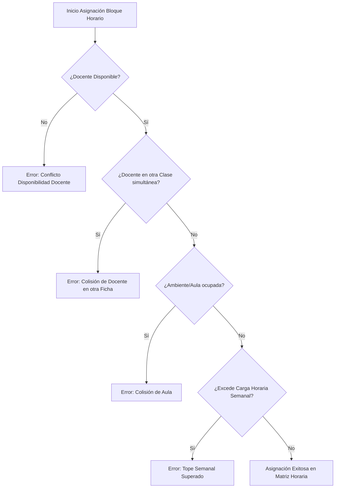
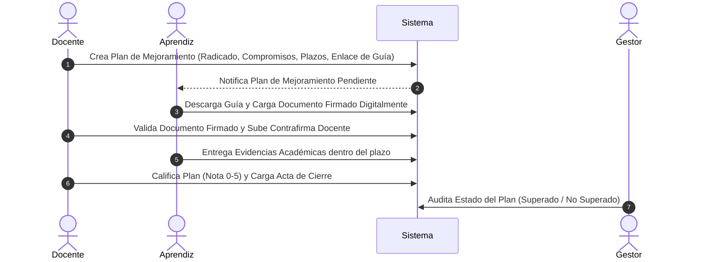
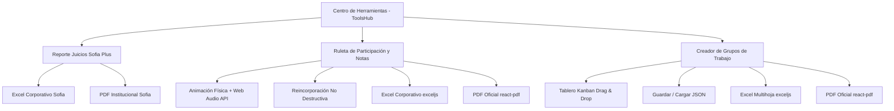

# Documentación Integral y Manual Funcional del Sistema — AcademiX V2

AcademiX V2 es una plataforma tecnológica de nivel empresarial diseñada para la gestión académica, control de asistencia, seguimiento conductual (observador digital), evaluación ponderada jerárquica, gestión de infraestructura y planificación horaria anticolisión. El sistema está estructurado con base en el modelo pedagógico del **SENA (Servicio Nacional de Aprendizaje)** de Colombia y centros de formación técnica y tecnológica superior.

La plataforma conecta a cinco actores principales bajo una arquitectura basada en roles (**RBAC**): **Administrador (`admin`)**, **Gestor Académico (`gestor`)**, **Observador (`observer`)**, **Docente / Instructor (`teacher`)** y **Aprendiz / Estudiante (`student`)**.

---

## Tabla de Contenido
1. [Arquitectura Tecnológica y Estructura del Código](#1-arquitectura-tecnológica-y-estructura-del-código)
2. [Matriz Comparativa de Roles y Permisos](#2-matriz-comparativa-de-roles-y-permisos)
3. [Funciones Estrictas por Rol de Usuario](#3-funciones-estrictas-por-rol-de-usuario)
   - [3.1. Rol: Administrador (`admin`)](#31-rol-administrador-admin)
   - [3.2. Rol: Gestor Académico (`gestor`)](#32-rol-gestor-académico-gestor)
   - [3.3. Rol: Observador (`observer`)](#33-rol-observador-observer)
   - [3.4. Rol: Docente / Instructor (`teacher`)](#34-rol-docente--instructor-teacher)
   - [3.5. Rol: Aprendiz / Estudiante (`student`)](#35-rol-aprendiz--estudiante-student)
4. [Módulos Especializados del Núcleo](#4-módulos-especializados-del-núcleo)
   - [4.1. Motor de Planificación Horaria y Detección Anticolisión](#41-motor-de-planificación-horaria-y-detección-anticolisión)
   - [4.2. Sistema de Calificaciones Jerárquicas Ponderadas](#42-sistema-de-calificaciones-jerárquicas-ponderadas)
   - [4.3. Planilla de Asistencia Matricial y Permisos Extemporáneos](#43-planilla-de-asistencia-matricial-y-permisos-extemporáneos)
   - [4.4. Observador Digital y Bitácora Formativa](#44-observador-digital-y-bitácora-formativa)
   - [4.5. Flujo de Planes de Mejoramiento (Compromisos y Firmas)](#45-flujo-de-planes-de-mejoramiento-compromisos-y-firmas)
   - [4.6. Suplantación de Sesión Segura (Impersonation) y Auditoría](#46-suplantación-de-sesión-segura-impersonation-y-auditoría)
   - [4.7. Centro de Herramientas Pedagógicas e Institucionales](#47-centro-de-herramientas-pedagógicas-e-institucionales)
   - [4.8. Estandarización Visual, Responsividad y Motor de Exportación Corporativa](#48-estandarización-visual-responsividad-y-motor-de-exportación-corporativa)
5. [Diccionario del Modelo de Datos (Prisma ORM)](#5-diccionario-del-modelo-de-datos-prisma-orm)
6. [Catálogo de Server Actions, Utilidades y APIs](#6-catálogo-de-server-actions-utilidades-y-apis)
7. [Scripts de Despliegue, Mantenimiento y CLI](#7-scripts-de-despliegue-mantenimiento-y-cli)

---

## 1. Arquitectura Tecnológica y Estructura del Código

AcademiX V2 sigue los principios de **Clean Architecture** bajo el patrón **Feature-First**:

*   **Framework Base:** Next.js 16 (App Router) compilado con **Turbopack**.
*   **Lenguaje:** TypeScript estricto con tipado estático en frontend, backend y esquema de datos.
*   **Base de Datos y ORM:** PostgreSQL (Neon Serverless) operado mediante **Prisma ORM** con características avanzadas de `relationJoins`.
*   **Autenticación y Seguridad:** **Better Auth** integrado con proveedores de credenciales locales, hash criptográfico de contraseñas, control de sesiones persistentes y suplantación segura de identidad (*impersonation*).
*   **Diseño y UI:** Tailwind CSS v4, Radix UI Primitives, componentes Shadcn UI, Lucide Icons y paletas temáticas dinámicas HSL.
*   **Notificaciones:** Alertas y toasts reactivos del sistema con `Sonner`.
*   **Exportación y Reportes Corporativos:** Generación avanzada de libros de cálculo multihoja con formato condicional y banners institucionales mediante **`exceljs`**, y generación declarativa en cliente de documentos vectoriales oficiales A4 con **`@react-pdf/renderer`**.
*   **Interacciones y Animación:** Arrastrar y soltar (*drag and drop*) accesible mediante **`@dnd-kit/core`** y **`@dnd-kit/sortable`**, animaciones físicas con **`Framer Motion`**, síntesis de sonido en tiempo real con **Web Audio API** y efectos de confeti con **`canvas-confetti`**.

### Estructura de Directorios Modular (Feature-First):
```text
src/
├── app/                              # App Router (páginas, layouts y API handlers)
│   ├── api/auth/                     # Endpoints Better Auth
│   ├── api/themes/                   # Configuración y temas dinámicos
│   ├── dashboard/                    # Rutas protegidas por rol
│   │   ├── admin/                    # Consola de administración general (/tools, /users, etc.)
│   │   ├── gestor/                   # Consola del Gestor Académico (/tools, /schedules, etc.)
│   │   ├── teacher/                  # Consola del Instructor (/tools, /attendance, /courses)
│   │   └── student/                  # Portal del Aprendiz (/records, /evaluations, /schedule)
├── features/                         # Lógica dividida por dominio de negocio
│   ├── admin/                        # Componentes, acciones y servicios de administración
│   │   ├── actions/                  # Server Actions (adminActions, academicActions)
│   │   ├── components/               # UI de usuarios, programas, analítica
│   │   └── services/                 # Servicios de negocio (auditLogger, etc.)
│   ├── auth/                         # Lógica de inicio de sesión, roles y sesiones
│   ├── schedule/                     # Motor de mallas horarias, colisiones y calendarios
│   ├── student/                      # Expedientes, inasistencias, planes de mejora
│   ├── teacher/                      # Planillas de asistencia, notas, ruleta, grupos
│   └── tools/                        # Centro de Herramientas Pedagógicas e Institucionales
│       ├── components/               # ToolsHub, ToolsDashboard, SofiaReportsTool, TeacherRouletteTool, etc.
│       ├── constants/                # toolsRegistry.ts (catálogo centralizado y permisos RBAC)
│       └── utils/                    # Exportadores corporativos (exceljs y @react-pdf/renderer)
├── components/                       # Componentes UI globales (Sidebar, Navbar, Theme, Modals)
├── lib/                              # Cliente Prisma, Auth, utilitarios y constantes
└── scripts/                          # Scripts de inicialización y CLI (create-admin, etc.)
```

---

## 2. Matriz Comparativa de Roles y Permisos

| Módulo / Capacidad | Administrador (`admin`) | Gestor Académico (`gestor`) | Observador (`observer`) | Instructor (`teacher`) | Aprendiz (`student`) |
| :--- | :---: | :---: | :---: | :---: | :---: |
| **Panel de Control Institucional** | Global Completo | Por Programas Asignados | Solo Lectura | Agenda de Aula | Dashboard Personal |
| **Gestión de Administradores** | Total (Crear, Editar, Eliminar) | ❌ Denegado | ❌ Denegado | ❌ Denegado | ❌ Denegado |
| **Gestión de Gestores y Asignación de Programas** | Total | ❌ Denegado | ❌ Denegado | ❌ Denegado | ❌ Denegado |
| **Gestión de Observadores** | Total | ❌ Denegado | ❌ Denegado | ❌ Denegado | ❌ Denegado |
| **Creación/Edición de Programas de Formación** | Total | ❌ Denegado (Supervisión) | Solo Lectura | ❌ Denegado | ❌ Denegado |
| **Estructuración Curricular (Periodos y Materias)** | Total | Programas a Cargo | Solo Lectura | ❌ Denegado | ❌ Denegado |
| **Gestión de Fichas (Grupos) y Matrícula** | Total | Programas a Cargo | Solo Lectura | Ver sus Fichas | Ver su Ficha |
| **Importación Masiva de Aprendices (Excel)** | Total | Programas a Cargo | ❌ Denegado | ❌ Denegado | ❌ Denegado |
| **Traslados de Ficha e Historial** | Total | Programas a Cargo | Solo Lectura | ❌ Denegado | Ver su Historial |
| **Gestión y Registro de Docentes** | Total | Programas a Cargo | Solo Lectura | ❌ Denegado | ❌ Denegado |
| **Cualificación Docente y Asignación de Cursos** | Total | Programas a Cargo | Solo Lectura | Ver sus Cursos | ❌ Denegado |
| **Planificación Horaria y Motor Anticolisión** | Total | Programas a Cargo | Solo Lectura | Declarar Disponibilidad | Ver Horario |
| **Gestión de Ambientes de Aprendizaje (Aulas)** | Total | Programas a Cargo | Solo Lectura | ❌ Denegado | ❌ Denegado |
| **Registro y Control Diario de Asistencia** | Supervisión / Permisos | Supervisión | Solo Lectura | Total (Marcación en Fichas) | Ver Inasistencias |
| **Justificación de Inasistencias** | Aprobar / Supervisar | Supervisar | Solo Lectura | Ver y Avalar | Radicar con Soporte |
| **Aprobación de Permisos Extemporáneos de Asistencia** | Total | Total | Solo Lectura | Solicitar Permiso | ❌ Denegado |
| **Observador Digital (Anotaciones Formativas)** | Auditoría Global | Auditoría en Programas | Auditoría Solo Lectura | Crear y Gestionar | Leer y Acuse de Recibo |
| **Calificaciones y Ponderaciones Jerárquicas** | Supervisión General | Supervisión en Programas | Solo Lectura | Configurar y Calificar | Ver Notas y Cortes |
| **Planes de Mejoramiento Académico** | Supervisión General | Supervisión en Programas | Solo Lectura | Crear, Asignar y Evaluar | Firmar y Cargar Evidencias |
| **Centro de Herramientas Pedagógicas (Tools Hub)** | Total | Total | Solo Lectura | Total | ❌ Denegado |
| **Herramienta: Juicios Evaluativos de Sofía Plus** | Total | Total | Solo Lectura | Total | ❌ Denegado |
| **Herramienta: Ruleta de Participación y Notas** | ❌ Denegado | ❌ Denegado | ❌ Denegado | **Exclusivo Instructor** | ❌ Denegado |
| **Herramienta: Creador de Grupos de Trabajo** | ❌ Denegado | ❌ Denegado | ❌ Denegado | **Exclusivo Instructor** | ❌ Denegado |
| **Suplantación de Identidad (*Impersonation*)** | Total con Auditoría | ❌ Denegado | ❌ Denegado | ❌ Denegado | ❌ Denegado |
| **Configuración Institucional (Branding/Temas)** | Total | ❌ Denegado | ❌ Denegado | ❌ Denegado | Preferencias Locales |
| **Restablecimiento de Contraseñas a Documento** | Total | Aprendices y Docentes | ❌ Denegado | ❌ Denegado | ❌ Denegado |

---

## 3. Funciones Estrictas por Rol de Usuario

---

### 3.1. Rol: Administrador (`admin`)

El Administrador ostenta la gobernanza directiva, técnica y de seguridad de toda la plataforma.

#### A. Gestión de Miembros del Equipo Directivo (`/dashboard/admin/users`)
*   **Gestión de Administradores:**
    *   Crear nuevos Administradores con nombre, apellido, documento, correo, teléfono y contraseña.
    *   Editar perfiles de administradores existentes.
    *   Restablecer contraseña de cualquier administrador a su número de documento de identidad con un solo clic.
    *   Eliminar cuentas de administradores (con protección de auto-eliminación para evitar bloqueos del sistema).
*   **Gestión y Asignación de Gestores Académicos:**
    *   Crear nuevos Gestores Académicos asignando uno o varios Programas de Formación bajo su responsabilidad (`managedPrograms`).
    *   Modificar la asignación de programas vinculados a cada gestor.
    *   Restablecer contraseñas de gestores.
    *   Eliminar gestores académicos.
*   **Gestión de Observadores:**
    *   Crear nuevos Observadores institucionales con restricción de acceso a programas y fichas específicas en modo solo lectura (`observedPrograms`, `observedGroups`).
    *   Editar asignaciones de visualización para observadores.
    *   Eliminar observadores.
*   **Filtros Avanzados y Búsqueda en Vivo:**
    *   Filtro interactivo por rol (`Todos`, `Administradores`, `Gestores`, `Observadores`) con contadores dinámicos.
    *   Búsqueda instantánea por nombre, correo electrónico o número de documento.
    *   Botón de limpieza inmediata de filtros y botón de recarga reactiva con servidor.

#### B. Gestión de Programas de Formación y Malla Curricular (`/dashboard/admin/courses`)
*   **Programas de Formación:**
    *   Crear, editar y eliminar Programas de Formación (ej. *ADSO - Análisis y Desarrollo de Software*, *Gestión Administrativa*).
    *   Configurar topes de horas semanales permitidas por docente para el programa.
    *   Habilitar/deshabilitar la edición extemporánea de asistencias pasadas a nivel de programa.
*   **Periodos o Fases de Formación (Trimestres):**
    *   Crear trimestres académicos asociados a cada programa.
    *   Establecer si un periodo es ordinario o especial.
    *   Reordenar trimestres mediante interfaz de arrastrar y soltar (*drag and drop*).
    *   Eliminar periodos curriculares.
*   **Competencias / Cursos:**
    *   Crear materias/competencias curriculares asignando título, descripción, horas semanales de trabajo, enlace externo (Classroom/Moodle), ícono representativo y badge identificador de color.
    *   Reordenar competencias dentro de cada periodo.
    *   Eliminar competencias académicas.
*   **Cualificación y Asignación Docente:**
    *   Asignar docentes habilitados para impartir cada competencia curricular.
    *   Designar el docente titular de la materia en cada ficha.

#### C. Gestión Global de Fichas (Grupos) e Infraestructura
*   **Fichas de Caracterización:**
    *   Crear fichas de formación con código de caracterización, nombre descriptivo, jornada lectiva, fechas de inicio y terminación, y categoría formativa (**Lectiva** o **Productiva**).
    *   Asignar un ambiente de formación principal (aula o laboratorio).
    *   Designar instructor tutor/líder de ficha.
*   **Ambientes de Aprendizaje (Aulas y Laboratorios):**
    *   Crear ambientes de formación física o virtual especificando nombre (ej. *Ambiente 302 - Computo*, *Taller Mecánica*), aforo máximo de aprendices, ubicación y recursos disponibles (*PCs, Proyector, Tablero Inteligente, Aire Acondicionado*).
    *   Editar y dar de baja ambientes de formación.

#### D. Planificación Horaria y Motor Anticolisión (`/dashboard/admin/schedules`)
*   Crear mallas horarias generales o por programa.
*   Diseñar franjas horarias por ficha de lunes a domingo.
*   Ejecutar el validador anticolisión que detecta solapamiento de instructores, cruces de aulas y excesos de carga horaria.
*   Publicar u ocultar los horarios para aprendices e instructores.
*   Registrar festivos institucionales y novedades horarias de fuerza mayor.

#### E. Analítica Institucional y Auditoría (`/dashboard/admin/analytics`)
*   Visualizar KPIs globales: total de aprendices matriculados, instructores activos, fichas en etapa lectiva/productiva, porcentaje de asistencia general.
*   Matriz de riesgo: aprendices en riesgo académico, deserción por inasistencia o alertas conductuales del observador.
*   Registro de auditoría (*Audit Logs*): trazabilidad de creación, edición y eliminación de usuarios, roles y notas con IP y usuario ejecutor.
*   **Suplantación de Sesión (*Impersonation*):** Iniciar sesión en un clic con la cuenta de cualquier usuario del centro para verificar errores o prestar soporte remoto, con registro estricto en auditoría.

#### F. Configuración Global del Sistema (`/dashboard/admin/settings`)
*   **Identidad Corporativa:** Configurar nombre de la institución, logotipo principal, logotipo alterno, favicon, imagen hero del login y enlaces a redes sociales.
*   **Parámetros Operativos del Sistema:**
    *   Límite de accesos diarios de aprendices.
    *   Carga horaria máxima permitida por docente.
    *   Restricción de modificación de asistencias a la semana en curso.
*   **Temas Visuales:** Definir el tema por defecto (Claro, Oscuro o Sistema), esquemas de color de acento HSL institucionales y tema del visor de código.

---

### 3.2. Rol: Gestor Académico (`gestor`)

El Gestor Académico es el **coordinador operativo directo** de los programas formativos asignados a su cargo (`managedPrograms`).

#### A. Consola del Gestor (`/dashboard/gestor`)
*   Panel de control filtrable por Programa de Formación a su cargo.
*   Indicadores en tiempo real de aprendices matriculados, fichas activas, competencias estructuradas y docentes vinculados.
*   Acceso a alertas tempranas de deserción e inasistencias acumuladas.

#### B. Directorio de Aprendices y Matrícula (`/dashboard/gestor/users`)
*   **Selector Dinámico por Ficha:** Navegación por píldoras (*pills*) de todas las fichas del programa a su cargo.
*   **Filtros por Etapa Formativa:** Filtrado de aprendices en **Etapa Lectiva** vs. **Etapa Productiva**.
*   **Registro Individual de Aprendices:** Formulario modal de matrícula con autocompletado de identificación, nombres, apellidos, correo, teléfono y asignación de ficha.
*   **Importación Masiva de Aprendices desde Excel:**
    *   Descarga de plantilla oficial en formato `.xlsx`.
    *   Carga masiva de aprendices con validación previa de duplicidad de documentos y correos electrónicos.
    *   Creación simultánea de cuentas y perfiles vinculados automáticamente a la ficha elegida.
*   **Traslado de Aprendices entre Fichas:**
    *   Mover aprendices de una ficha a otra con registro de motivo.
    *   Mantenimiento del historial de traslados previos (`GroupEnrollment`) para trazabilidad académica.
*   **Gestión de Novedades de Aprendiz:** Marcar novedades disciplinarias o administrativas en el perfil del aprendiz (*Cancelación de Matrícula, Aplazamiento, Traslado, Deserción*).
*   **Restablecimiento de Contraseñas:** Restaurar la contraseña de cualquier aprendiz a su número de documento en caso de olvido.
*   **Analítica del Grupo:** Abrir panel analítico del grupo con métricas de asistencia consolidada, notas promedio y distribución de calificaciones.

#### C. Directorio de Docentes del Programa (`/dashboard/gestor/users?tab=teachers`)
*   Directorio de instructores asignados a sus programas de formación.
*   Registro manual de nuevos docentes.
*   Edición de datos de contacto de los instructores.
*   Visualización de competencias habilitadas para cada docente.
*   Restablecimiento de contraseñas de instructores a su número de documento.

#### D. Estructuración Curricular del Programa (`/dashboard/gestor/courses`)
*   Administración de los periodos (trimestres) del programa.
*   Creación, edición y ordenamiento de materias y competencias formativas.
*   Configuración de horas semanales sugeridas e intensidades horarias.
*   Asignación de fichas y aulas a las materias.
*   Cualificación pedagógica de los instructores para cada materia del programa.

#### E. Planificación Horaria Operativa (`/dashboard/gestor/schedules`)
*   Creación y edición de las mallas horarias semanales de las fichas a su cargo.
*   Asignación de instructores y ambientes de formación en la matriz horaria.
*   Validación inmediata del motor anticolisión (evita cruces de docentes y aulas).
*   Aprobación de solicitudes de permisos de asistencia extemporánea remitidas por los instructores.
*   Gestión de eventos especiales y novedades de horario en sus programas.

#### F. Seguimiento a Planes de Mejoramiento (`/dashboard/gestor/users?tab=students&subtab=plans`)
*   Monitoreo centralizado de todos los planes de mejoramiento abiertos por los instructores.
*   Verificación del estado del plan: *Emitido, Firmado por Aprendiz, Evaluado por Docente*.
*   Auditoría de evidencias cargadas y notas de recuperación asignadas.

---

### 3.3. Rol: Observador (`observer`)

El Observador es un rol de auditoría, inspección y supervisión pedagógica o directiva externa.

#### A. Ámbito y Restricción de Acceso
*   Acceso restringido únicamente a los Programas de Formación (`observedPrograms`) y Fichas (`observedGroups`) expresamente autorizados por el Administrador.
*   **Régimen Estricto de Solo Lectura:** El observador puede navegar, consultar y exportar información, pero **todos los controles de modificación, alta, baja y edición están deshabilitados**.

#### B. Capacidades de Consulta
*   **Supervisión de Mallas Curriculares:** Consultar competencias, trimestres, intensidades horarias y docentes cualificados.
*   **Consulta de Fichas y Aprendices:** Visualizar listas de aprendices, datos de contacto, fichas activas y estados formativos.
*   **Consulta de Asistencias y Observador:**
    *   Ver matrices de asistencia consolidadas por ficha y por estudiante.
    *   Ver bitácora de anotaciones del observador digital realizadas por los instructores.
*   **Consulta de Horarios:** Visualizar la programación horaria semanal publicada y los ambientes de formación utilizados.
*   **Seguimiento de Planes de Mejoramiento:** Auditar actas de compromiso, evidencias y calificaciones de recuperación.
*   **Exportación de Reportes:** Descargar reportes en Excel o PDF para fines de inspección y calidad académica.

---

### 3.4. Rol: Docente / Instructor (`teacher`)

El Instructor es el líder pedagógico del aula y administra las fichas a las que ha sido asignado.

#### A. Consola del Instructor (`/dashboard/teacher`)
*   Selector de Fichas asignadas con badge de competencia y periodo activo.
*   Acceso a la consola integral de ficha (`GroupManager.tsx`).

#### B. Planilla de Asistencia Matricial (`/dashboard/teacher`)
*   **Marcación de Estados de Asistencia:**
    *   **`PRESENT` (Presente):** Asistencia puntual a la sesión.
    *   **`ABSENT` (Ausente):** Inasistencia no justificada.
    *   **`LATE` (Llegada Tarde):** Retraso con registro opcional de hora de ingreso.
    *   **`LEAVE_EARLY` (Retiro Temprano):** Abandono antes del fin de la jornada.
    *   **`EXCUSED` (Excusa / Justificada):** Inasistencia avalada formalmente.
*   **Navegación Móvil Táctil (`touch-pan-x`):** Desplazamiento horizontal fluido en dispositivos móviles y tabletas sobre toda la matriz de fechas y totales de fallas (`F`), tardanzas (`T`) y retiros (`R`).
*   **Marcación Rápida:** Botón para marcar a toda la ficha como presente en un solo clic.
*   **Solicitud de Permiso Extemporáneo:** Formulario para solicitar al Administrador o Gestor la apertura de una semana anterior cerrada para corregir asistencias pasadas.

#### C. Observador Digital de Aula (`RemarkManagerDialog.tsx`)
*   Creación de anotaciones formativas dirigidas a aprendices específicos:
    *   `ATTENTION`: Llamados de atención verbal o escrito.
    *   `COMMENDATION`: Felicitaciones y reconocimientos por desempeño sobresaliente.
    *   `CITATION`: Citaciones formales a coordinación o acudiente.
    *   `OTHER`: Otras observaciones de seguimiento pedagógico.
*   **Plantillas Predefinidas (`RemarkTemplate`):** Carga rápida de causales y descripciones frecuentes.
*   **Trazabilidad de Notificación (`viewedAt`):** Registro exacto de fecha y hora en que el aprendiz abrió y leyó la anotación en su portal.

#### D. Calificaciones Ponderadas Jerárquicas (`GradeManagerPanel.tsx`)
*   **Modos de Evaluación:**
    *   Ponderación porcentual (`usePercentageWeights = true`).
    *   Evaluación acumulativa por puntos.
*   **Estructura Jerárquica:**
    *   **Cortes Académicos (`GradeCategory`):** Ej. *Primer Corte (30%)*, *Segundo Corte (30%)*, *Tercer Corte (40%)*.
    *   **Grupos de Actividades (`GradeGroup`):** Ej. *Talleres Prácticos (40%)*, *Exámenes Técnicos (40%)*, *Participación (20%)*.
    *   **Actividades Específicas (`Activity`):** Creación de tareas con peso relativo, fecha límite y opción de recepción de enlace de evidencia.
*   **Calificación de Entregas:** Asignación de nota cuantitativa (0.0 a 5.0) y retroalimentación personalizada (*feedback*).
*   **Exportación Oficial a Excel:** Generación automática de libro de calificaciones con fórmulas de ponderación y formato institucional.

#### E. Planes de Mejoramiento (`ImprovementPlanDialog.tsx`)
*   Apertura formal de planes de mejoramiento para aprendices con bajo rendimiento o inasistencias críticas.
*   Asignación de número de radicado, descripción de compromisos y plazos (fechas de inicio y entrega).
*   **Carga de Documento Inicial (`teacherDocUrl`):** Enlace con las actividades a desarrollar.
*   **Recepción y Revisión:** Verificación del documento firmado subido por el aprendiz (`signedDocUrl`).
*   **Contrafirma Docente y Evaluación:** Carga del documento con contrafirma del instructor (`teacherSignedDocUrl`), evidencia de sustentación (`evidenceUrl`) y nota definitiva de superación del plan.

#### F. Centro de Herramientas Pedagógicas del Instructor (`/dashboard/teacher/tools`)
*   **Ruleta de Participación y Notas (`Roulette.tsx`):**
    *   Dinámica interactiva con animación física de giro y efectos sonoros retro sintetizados en tiempo real mediante Web Audio API.
    *   Asignación y registro inmediato de calificaciones cuantitativas (0.0 a 5.0).
    *   **Reincorporación No Destructiva de Aprendices:** Permite volver a incluir en la rueda a aprendices que ya salieron sin perder su turno ni su nota registrada en el historial.
    *   Opción de retención inmediata en el modal del ganador (*¡TENEMOS UN GANADOR!*) para permitir que un aprendiz continúe en la ruleta en rondas consecutivas.
    *   Botón de acción masiva *"Reincorporar todos"* para rearmar la ruleta completa conservando todas las calificaciones registradas.
    *   Exportación corporativa de resultados a **Excel (.xlsx)** mediante `exceljs` y **PDF (.pdf)** oficial con `@react-pdf/renderer`.
*   **Creador de Grupos de Trabajo (`GroupGenerator.tsx`):**
    *   Distribución y conformación automática y balanceada de equipos de trabajo mediante algoritmo aleatorio.
    *   Tablero interactivo de organización manual con tecnología Drag & Drop accesible (`@dnd-kit`).
    *   Edición de nombres de equipos en tiempo real, persistencia local y guardado/importación de proyectos en formato `.json`.
    *   Exportación corporativa multihoja a **Excel (.xlsx)** (*Equipos de Trabajo* y *Listado Consolidado Maestro*) y tarjetas estructuradas a **PDF (.pdf)**.
*   **Reporte de Juicios Evaluativos de Sofía Plus (`SofiaReportsTool.tsx`):**
    *   Carga y auditoría de archivos de Sofia Plus con procesamiento 100% en cliente sin almacenamiento externo.
    *   Matriz dinámica de juicios (*Aprobados* y *Por Evaluar*), organizador curricular de Resultados de Aprendizaje (RA) y analítica gráfica.
    *   Exportación ejecutiva a Excel y PDF con estética institucional.
*   **Contenido Compartido (`SharedContent`):** Publicación de enlaces de interés, repositorios, guías y recursos bibliográficos para la ficha.

#### G. Gestión de Disponibilidad Horaria (`/dashboard/teacher/schedule`)
*   Visualización de su horario de clases semanal por ambiente y ficha.
*   Declaración interactiva de bloques de disponibilidad horaria semanal para ser considerada por el motor de planificación.

---

### 3.5. Rol: Aprendiz / Estudiante (`student`)

El Aprendiz es el beneficiario de la formación y cuenta con un portal autónomo de consulta y autogestión.

#### A. Panel Principal (`/dashboard/student`)
*   Visualización de KPIs personales en tiempo real:
    *   Porcentaje general de asistencia acumulada.
    *   Ficha activa y competencia en curso.
    *   Promedio ponderado de calificaciones.
    *   Notificaciones de nuevas observaciones o tareas pendientes.
*   **Agenda del Día:** Detalle de clases programadas para el día con hora, materia, aula asignada e instructor titular.

#### B. Expediente y Registro Académico (`/dashboard/student/records`)
*   **Diseño Full-Width:** Visualización completa de expediente sin restricciones de ancho.
*   **Historial de Fichas:** Selector para consultar su ficha activa o el historial de notas y asistencias de fichas anteriores (`GroupEnrollment`).
*   **Radicación de Justificaciones de Inasistencia:**
    *   Identificación de fechas con estado `ABSENT`.
    *   Formulario de radicación con motivo de la ausencia y enlace a soporte digital (incapacidad médica o calamidad).
    *   Consulta del estado de aprobación de la justificación.
*   **Observador Digital del Aprendiz:**
    *   Lectura de todas las anotaciones formativas realizadas por los instructores.
    *   Emisión automática del acuse de recibo digital (`viewedAt`) al momento de abrir la observación.
*   **Firma y Evidencias de Planes de Mejoramiento:**
    *   Descarga del documento de compromisos emitido por el docente.
    *   Carga del documento firmado digitalmente por el aprendiz.
    *   Carga de evidencias de cumplimiento académico.
    *   Consulta de la calificación final obtenida.
*   **Descarga de Boletines:** Descarga de reportes académicos y boletines de notas consolidadas en PDF o Excel.

#### C. Consulta de Programación Horaria (`/dashboard/student/schedule`)
*   Calendario semanal y mensual de clases con ambientes de aprendizaje y docentes.
*   Consulta de eventos institucionales y festivos que aplican a su ficha.
*   Visualización de novedades horarias (cambios de aula, suspensiones o sesiones virtuales).

---

## 4. Módulos Especializados del Núcleo

---

### 4.1. Motor de Planificación Horaria y Detección Anticolisión

Ubicado en `src/features/schedule/` y gestionado mediante [SchedulePlanning.tsx](file:///c:/Users/Jhon/Documents/Datos/Informacion/2026/Proyectos/AcademixV2/src/features/admin/components/SchedulePlanning.tsx):



*   **Validaciones en Tiempo Real:**
    1.  **Doble Reserva de Docente:** Un instructor no puede tener asignadas dos sesiones en el mismo día y franja horaria.
    2.  **Doble Reserva de Ambiente:** Un aula física no puede superar su aforo ni albergar dos fichas a la vez.
    3.  **Límite Horario Semanal:** Controla que el docente no sobrepase el parámetro institucional (ej. 40 horas semanales).
    4.  **Cruce de Ficha:** Garantiza que la ficha no tenga dos clases simultáneas.
*   **Estados de Publicación:** Los horarios se gestionan en estado **Borrador (`isPublished = false`)** y solo se hacen visibles para instructores y aprendices cuando el Administrador o Gestor realiza la publicación formal.

---

### 4.2. Sistema de Calificaciones Jerárquicas Ponderadas

Ubicado en [GradeManagerPanel.tsx](file:///c:/Users/Jhon/Documents/Datos/Informacion/2026/Proyectos/AcademixV2/src/features/teacher/components/GradeManagerPanel.tsx):

```text
Curso / Competencia (100%)
│
├── Corte 1: GradeCategory (Peso: 30%)
│   ├── Grupo 1: Talleres Prácticos (Peso: 50% del Corte)
│   │   ├── Actividad 1: Taller Algoritmos (Peso interno)
│   │   └── Actividad 2: Diagramas UML (Peso interno)
│   └── Grupo 2: Evaluación Técnica (Peso: 50% del Corte)
│       └── Actividad 3: Parcial Escrito
│
├── Corte 2: GradeCategory (Peso: 30%)
└── Corte 3: GradeCategory (Peso: 40%)
```

*   Permite alternar entre ponderación porcentual y suma absoluta de puntos.
*   Cálculo reactivo automático de promedios ponderados por corte y nota final del curso.
*   Generación de planillas matriciales exportables a Excel con formato institucional de celdas.

---

### 4.3. Planilla de Asistencia Matricial y Permisos Extemporáneos

Implementada en [GroupManager.tsx](file:///c:/Users/Jhon/Documents/Datos/Informacion/2026/Proyectos/AcademixV2/src/features/teacher/components/GroupManager.tsx):

*   **Matriz Responsiva:** Tabla interactiva con columnas fijas de aprendices y columnas dinámicas por fecha de formación con scroll horizontal optimizado para móviles (`touch-pan-x`).
*   **Cierre de Semanas:** Si el parámetro `limitAttendanceToCurrentWeek` está activo, las semanas previas quedan bloqueadas para evitar adulteraciones posteriores.
*   **Flujo de Permiso Extemporáneo (`AttendancePermissionRequest`):**
    1.  El docente solicita modificación indicando ficha, fecha y justificación.
    2.  El Gestor o Administrador recibe la notificación y aprueba o rechaza la solicitud.
    3.  Al ser aprobada, el docente cuenta con una ventana de tiempo para corregir la asistencia.

---

### 4.4. Observador Digital y Bitácora Formativa

Implementado en [RemarkManagerDialog.tsx](file:///c:/Users/Jhon/Documents/Datos/Informacion/2026/Proyectos/AcademixV2/src/features/teacher/components/RemarkManagerDialog.tsx):

*   **Categorías Formativas:** `ATTENTION` (Llamado de atención), `COMMENDATION` (Felicitación), `CITATION` (Citación), `OTHER` (Anotación general).
*   **Acuse de Recibo Inmutable (`viewedAt`):** Al momento exacto en que el aprendiz inicia sesión y abre el detalle de la anotación, el backend estampa la fecha y hora de lectura. Esto elimina reclamos de desconocimiento en procesos de comité de evaluación.
*   **Plantillas Rápidas (`RemarkTemplate`):** Banco de textos estandarizados según el manual de convivencia institucional.

---

### 4.5. Flujo de Planes de Mejoramiento (Compromisos y Firmas)

Implementado en [ImprovementPlanDialog.tsx](file:///c:/Users/Jhon/Documents/Datos/Informacion/2026/Proyectos/AcademixV2/src/features/teacher/components/ImprovementPlanDialog.tsx):



---

### 4.6. Suplantación de Sesión Segura (Impersonation) y Auditoría

Implementado mediante Better Auth y [auditLogger.ts](file:///c:/Users/Jhon/Documents/Datos/Informacion/2026/Proyectos/AcademixV2/src/features/admin/services/auditLogger.ts):

*   **Uso Exclusivo:** Rol `admin`.
*   **Propósito:** Soporte remoto inmediato y reproducción de incidencias reportadas por aprendices o instructores sin vulnerar ni solicitar contraseñas.
*   **Mecanismo:** Generación de un token de sesión temporal donde el campo `impersonatedBy` almacena el identificador del administrador que opera la sesión.
*   **Banner de Advertencia:** En la interfaz superior aparece una barra flotante que indica: *"Sesión suplantada activa como [Nombre Usuario] - Salir de la suplantación"*.
---

### 4.7. Centro de Herramientas Pedagógicas e Institucionales (`src/features/tools/`)

El Centro de Herramientas es un subsistema modular de utilidades de productividad docente y auditoría curricular gobernado por el registro centralizado [toolsRegistry.ts](file:///c:/Users/Jhon/Documents/Datos/Informacion/2026/Proyectos/AcademixV2/src/features/tools/constants/toolsRegistry.ts).



#### A. Reporte de Juicios Evaluativos de Sofía Plus (`SofiaReportsTool.tsx`)
*   **Procesamiento 100% en Cliente:** Carga y análisis inmediato de archivos de reporte exportados desde Sofía Plus sin subir datos sensibles a servidores remotos.
*   **Matriz Dinámica de Juicios:** Cruce matricial de aprendices vs. Resultados de Aprendizaje (RA) clasificados por estado: *Aprobado (A)* y *Por Evaluar (D / Pendiente)*.
*   **Organizador Curricular Interactivo:** Permite distribuir y reasignar los Resultados de Aprendizaje por periodo formativo mediante interfaz de arrastrar y soltar.
*   **Analítica Visual de la Ficha:** Gráficos e indicadores de porcentaje de avance evaluativo, aprendices al día vs. aprendices con juicios pendientes.
*   **Exportación Corporativa:** Descarga de informes formateados con la identidad SENA tanto en Excel (`sofiaCorporateExcelExport.ts`) como en PDF (`sofiaCorporatePdfExport.tsx`).

#### B. Ruleta de Participación y Notas (`Roulette.tsx` / `TeacherRouletteTool.tsx`)
Exclusiva para el rol de **Instructor** (`allowedRoles: ["teacher"]`).
*   **Simulación Física y Audiovisual:**
    *   Cálculo angular de detención con animación easing en desaceleración suave (`Framer Motion`).
    *   Efectos sonoros retro sintetizados en tiempo real mediante **Web Audio API** (osciladores triangulares con rampas exponenciales de frecuencia sincronizados con el paso de cada casilla).
    *   Arpegio musical de victoria y lluvia de confeti de partículas al seleccionar al ganador.
*   **Calificación en Vivo:** Ventana modal inmediata para asignar notas cuantitativas (1.0 a 5.0) o ingreso decimal manual.
*   **Reincorporación No Destructiva de Aprendices:**
    *   **Preservación Total del Historial:** A diferencia de sistemas simples que eliminan el registro al volver a colocar a un aprendiz en la ruleta, AcademiX conserva intacto el turno, la fecha y la calificación asignada en la columna de seleccionados y en los reportes finales.
    *   **Indicador de Estado en Vivo:** Si el aprendiz ya está activo en la ruleta, muestra el badge **`✓ En ruleta`**. Si fue seleccionado y retirado, muestra el botón **`[+ Reincorporar]`**.
    *   **Opción Directa en Modal de Ganador:** Casilla interactiva `[ ] Mantener en la ruleta (permitir repetir)` para decidir en el instante de la calificación si el aprendiz continúa disponible para las siguientes rondas.
    *   **Acción Masiva "Reincorporar todos":** Botón en cabecera que permite recargar la rueda completa con toda la ficha sin borrar ninguna de las notas previamente asignadas (ideal para rondas múltiples de evaluación).
    *   **Gestión Individual de Notas:** Edición de calificaciones vinculada a la marca temporal (`timestamp`) de cada turno particular, evitando sobreescrituras si un aprendiz participa más de una vez.
    *   **Eliminación Segura (`Trash2`):** Botón para descartar giros erróneos o pruebas del historial.
*   **Exportación Corporativa (`rouletteCorporateExport.tsx`):**
    *   Menú desplegable `<DropdownMenu>` con estado de carga animado (`Loader2`).
    *   **Excel (.xlsx) con `exceljs`:** Encabezado institucional *Slate 900*, metadatos de ficha y fecha, barra KPI de totales, promedio y tasa de aprobación, encabezados verde esmeralda (`#15803D`), filas cebra y formato condicional con badges para notas aprobadas ($\ge 3.0$) y por mejorar ($< 3.0$).
    *   **PDF (.pdf) con `@react-pdf/renderer`:** Documento A4 vertical oficial, membrete verde institucional, barra resumen de estadísticas, tabla de notas y pie de página con paginación automática.

#### C. Creador de Grupos de Trabajo Colaborativo (`GroupGenerator.tsx` / `TeacherGroupGeneratorTool.tsx`)
Exclusivo para el rol de **Instructor** (`allowedRoles: ["teacher"]`).
*   **Generador Aleatorio Equitativo:** Algoritmo de distribución aleatoria balanceada para conformar $N$ equipos de trabajo según la cantidad deseada.
*   **Tablero Kanban con Drag & Drop (`@dnd-kit`):**
    *   Panel lateral con el listado de aprendices disponibles ("Sin Grupo") con buscador y contador dinámico.
    *   Arrastre fluido entre columnas y hacia las tarjetas de los equipos de trabajo.
    *   Renombramiento interactivo del nombre de cada grupo en línea.
*   **Persistencia y Exportación JSON:** Posibilidad de guardar el estado completo de conformación grupal en archivo `.json` y recargarlo en sesiones posteriores.
*   **Exportación Corporativa Multihoja (`groupCorporateExport.tsx`):**
    *   **Excel (.xlsx) con `exceljs`:**
        *   *Hoja 1 ("Equipos de Trabajo"):* Bloques independientes por cada equipo con cabeceras verde esmeralda suave (`#D1FAE5`), conteo de integrantes, identificación, nombre del aprendiz, rol asignado (*Líder de Equipo*, *Integrante*), columna de firmas/observaciones y sección especial para aprendices sin asignar.
        *   *Hoja 2 ("Listado Consolidado"):* Tabla maestra consolidada ideal para ordenar, filtrar e imprimir toda la ficha.
    *   **PDF (.pdf) con `@react-pdf/renderer`:**
        *   Tarjetas modulares por equipo que evitan saltos de página inadecuados (`wrap={false}`).
        *   Bloque destacado para aprendices pendientes de asignación.
        *   Barra KPI con promedio de aprendices por equipo.
        *   Pie de página institucional numerado.

---

### 4.8. Estandarización Visual, Responsividad y Motor de Exportación Corporativa

#### A. Patrón "Hero Banner Estándar Dorado"
Todas las pestañas de ficha de formación (*Aprendices, Asistencia, Observaciones, Planes de Mejoramiento, Calificaciones, Documentación, Analítica*) y los módulos directivos fueron estandarizados bajo un lenguaje visual idéntico:
*   **Contenedor Translúcido:** `bg-primary/5 border border-primary/20 rounded-2xl sm:rounded-3xl p-4 sm:p-6 lg:p-7 relative overflow-hidden shadow-2xs`.
*   **Marca de Agua SVG Temática:** Ícono vectorial de alta resolución en la esquina superior derecha (`text-primary/5 -right-3 -bottom-6 w-32 h-32 pointer-events-none`).
*   **Jerarquía Tipográfica:** Títulos en `font-black text-xl sm:text-2xl text-foreground` con subtítulo explicativo y badges de contexto en `bg-primary/10 text-primary border-primary/20`.

#### B. Contención Estricta al Viewport y Eliminación de Scroll de Ventana
*   Se eliminaron las alturas mínimas rígidas (`min-h-[600px]`) y paddings duplicados que obligaban a la página a desbordarse verticalmente.
*   Las herramientas pedagógicas operan bajo un límite estricto de altura respecto a la ventana del navegador (`h-[calc(100vh-170px)]` o `h-full min-h-0 overflow-hidden`).
*   La página del navegador **no genera scroll vertical**.
*   Toda navegación extensa (listados de aprendices, historial de ruleta, tableros de grupos) se maneja mediante **scrolls internos asíncronos e independientes** (`overflow-y-auto custom-scrollbar`), preservando siempre visibles la ruleta, la barra de herramientas y los controles de acción.
*   La rueda de la ruleta se autoescala proporcionalmente según la altura disponible del monitor (`max-h-[min(540px,calc(100vh-210px))]`).

#### C. Consistencia Temática Global en el Sidebar
*   Sincronización total con la paleta activa (Ocean Breeze, Cyberpunk, Forest, Sunset, Slate, etc.) en todos los roles del sistema (*Admin, Gestor, Instructor, Aprendiz, Observador*).
*   Eliminación de colores estáticos arcoíris en favor de tokens HSL semánticos.
*   El indicador activo utiliza un destello dinámico con `var(--primary)` y las píldoras activas usan `bg-primary/10 text-primary border-primary/25`.
*   Resolución precisa de ítems activos en URLs con parámetros de búsqueda (`item.url.split('?')[0]`).

#### D. Estándar de Exportación Corporativa SENA / AcademiX
Todos los reportes generados en el sistema siguen una guía de estilo gráfica común:
*   **Paleta de Color:** Verde SENA Esmeralda (`#15803D`), Acentos Oscuros Slate 900 (`#0F172A`), Fondos Suaves (`#F1F5F9` / `#DCFCE7`).
*   **Tipografía:** Segoe UI para libros Excel de alta legibilidad y Helvetica para documentos vectoriales PDF.
*   **Metadatos Automatizados:** Rótulos oficiales con nombre de la ficha, código de caracterización, fecha en español colombiano y autoría institucional.

---

## 5. Diccionario del Modelo de Datos (Prisma ORM)

El archivo [`prisma/schema.prisma`](file:///c:/Users/Jhon/Documents/Datos/Informacion/2026/Proyectos/AcademixV2/prisma/schema.prisma) define las siguientes entidades maestras:

### 1. `User` (Usuario Principal)
*   `id` (`String`, PK): Identificador único UUID.
*   `name` (`String`): Nombre completo.
*   `email` (`String`, Unique): Correo electrónico institucional o personal.
*   `role` (`String`): Rol del usuario (`admin`, `gestor`, `observer`, `teacher`, `student`).
*   `banned` (`Boolean`): Estado de suspensión de cuenta.
*   `banReason` (`String`): Motivo de la suspensión.
*   `groupId` (`String`, FK opcional): Ficha formativa principal (para aprendices).
*   `availabilityLocked` (`Boolean`): Bloqueo de edición de disponibilidad para docentes.

### 2. `Profile` (Información Personal y Sensible)
*   `identificacion` (`String`): Cédula de ciudadanía, tarjeta de identidad o documento legal.
*   `nombres` (`String`): Nombres del usuario.
*   `apellido` (`String`): Apellidos del usuario.
*   `telefono` (`String`): Teléfono de contacto.
*   `novedad` (`String`): Novedad académica del estudiante (*Retiro, Aplazamiento, Deserción*).
*   `dataProcessingConsent` (`Boolean`): Aceptación de política de tratamiento de datos (Habeas Data).

### 3. `Program` (Programa de Formación)
*   `name` (`String`): Nombre del programa de formación técnica/tecnológica.
*   `maxTeacherHours` (`Int`): Intensidad horaria semanal máxima permitida a instructores del programa.
*   `allowPastAttendanceEdit` (`Boolean`): Autorización de modificación de asistencias pasadas.
*   *Relaciones:* Vinculado a `gestores` (`User[]`), `observers` (`User[]`), `teachers` (`User[]`), `groups` (`Group[]`) y `periods` (`Period[]`).

### 4. `Period` (Periodo o Trimestre Académico)
*   `name` (`String`): Denominación del periodo (ej. *Trimestre I*, *Trimestre II*).
*   `order` (`Int`): Orden secuencial en la malla curricular.
*   `esEspecial` (`Boolean`): Indicador de periodo de nivelación o extraordinario.

### 5. `Group` (Ficha de Caracterización / Grupo)
*   `name` (`String`): Código oficial de la ficha (ej. *2693521*).
*   `description` (`String`): Nombre del programa o especialidad.
*   `categoria` (`String`): Etapa formativa (**`LECTIVA`** o **`PRODUCTIVA`**).
*   `startDate` / `endDate` (`DateTime`): Fechas oficiales de vigencia de la ficha.
*   `environmentId` (`String`, FK): Aula o ambiente de formación asignado.

### 6. `GroupEnrollment` (Historial de Aprendices en Fichas)
*   `studentId` (`String`, FK) y `groupId` (`String`, FK).
*   `status` (`GroupEnrollmentStatus`): `ACTIVE`, `TRANSFERRED`, `COMPLETED`, `WITHDRAWN`.
*   `isCurrent` (`Boolean`): Si representa la ficha activa del aprendiz.
*   `notes` (`String`): Observaciones sobre traslados o cambios de grupo.

### 7. `Course` (Materia o Competencia Curricular)
*   `title` (`String`): Nombre de la competencia o materia.
*   `weeklyHours` (`Float`): Horas semanales sugeridas.
*   `usePercentageWeights` (`Boolean`): Indica si usa ponderación porcentual (100%) o acumulativa.
*   `teacherId` (`String`, FK): Docente titular asignado.

### 8. `Attendance` (Registro Diario de Asistencia)
*   `date` (`DateTime`): Fecha de la sesión.
*   `status` (`AttendanceStatus`): `PRESENT`, `ABSENT`, `LATE`, `LEAVE_EARLY`.
*   `justification` (`String`): Motivo radicado por el aprendiz.
*   `justificationUrl` (`String`): Enlace al comprobante digital.

### 9. `Remark` (Anotación en el Observador Digital)
*   `type` (`RemarkType`): `ATTENTION`, `COMMENDATION`, `CITATION`, `OTHER`.
*   `title` / `description` (`String`): Detalle del hecho u observación.
*   `viewedAt` (`DateTime`): Marca temporal del acuse de recibo del aprendiz.

### 10. `ImprovementPlan` (Plan de Mejoramiento)
*   `planNumber` (`String`): Número único de radicación del acta.
*   `teacherDocUrl` (`String`): Enlace al documento original emitido por el docente.
*   `signedDocUrl` (`String`): Enlace al documento firmado por el aprendiz.
*   `teacherSignedDocUrl` (`String`): Enlace con contrafirma docente.
*   `evidenceUrl` (`String`): Enlace a evidencias de sustentación.
*   `planScore` / `finalGrade` (`Float`): Calificaciones de recuperación asignadas.

### 11. `TrainingEnvironment` (Ambiente de Formación / Aula)
*   `name` (`String`): Nombre identificador del ambiente.
*   `capacity` (`Int`): Aforo máximo de puestos.
*   `resources` (`String[]`): Equipamiento disponible.

### 12. `AcademicSchedule` & `ScheduleGroupSlot` (Mallas Horarias)
*   Define el horario académico, sus franjas semanales por ficha, día de la semana (`DayOfWeek`), hora de inicio (`startTime`) y hora de fin (`endTime`).

### 13. `ScheduleNovelty` (Novedades de Horario)
*   Tipos: `SCHEDULE_SUSPENSION`, `ROOM_CHANGE`, `CLASS_RESCHEDULE`, `TECHNICAL_OUTAGE`, `INSTITUTIONAL_EVENT`, `VIRTUAL_SESSION`, `OTHER`.

---

## 6. Catálogo de Server Actions, Utilidades y APIs

Todas las acciones del servidor se ejecutan bajo el modelo `"use server"` con validación estricta de sesión y roles (`requireAdmin`, `requireAdminOrObserver`, `requireCoordinator`):

### A. Acciones de Administración y Usuarios (`adminActions.ts`)
*   `getAdminDashboardStatsAction()`: Obtiene estadísticas consolidadas para admin o gestor.
*   `getAllUsersAction({ role, groupId, programId, limit, page })`: Listado paginado y filtrado de usuarios.
*   `createUserAction(data)`: Crea estudiantes o docentes con perfil, credenciales y validación de duplicados.
*   `createAdminOrObserverAction(data)`: Crea Administradores, Gestores u Observadores asociando programas y fichas.
*   `updateAdminOrObserverAction(id, data)`: Modifica información, roles y asignación de programas/fichas.
*   `deleteAdminOrObserverAction(id)`: Elimina usuarios directivos con auditoría.
*   `getAdminsAndObserversAction()`: Retorna todos los directivos con programas asignados formateados.
*   `resetUserPasswordToDocAction(userId)`: Restaura la contraseña del usuario a su documento de identidad.
*   `toggleUserBanAction(userId, reason)`: Bloquea o reactiva el acceso de un usuario.
*   `updateStudentNovedadAction(userId, novedad, color)`: Registra novedades de matrícula en el aprendiz.
*   `getSystemSettingsAction()` / `updateSystemSettingsAction(data)`: Consulta y modifica los parámetros globales del sistema.

### B. Acciones Académicas y Curriculares (`academicActions.ts`)
*   `getProgramsAction()` / `createProgramAction(data)` / `updateProgramAction(id, data)` / `deleteProgramAction(id)`: Ciclo de vida de programas formativos.
*   `getGroupsAction()` / `createGroupAction(data)` / `updateGroupAction(id, data)` / `deleteGroupAction(id)`: Ciclo de vida de fichas de caracterización.
*   `createPeriodAction(data)` / `updatePeriodAction(id, data)` / `deletePeriodAction(id)` / `reorderPeriodsAction(ids)`: Manejo de trimestres formativos.
*   `assignCourseToPeriodAction(data)` / `reorderCoursesAction(ids)` / `deleteCourseAction(id)`: Manejo de competencias en trimestres.
*   `registerStudentManualAction(data)`: Registro individual de aprendices con asignación a ficha.
*   `registerStudentsBulkAction(students, groupId)`: Registro masivo desde planilla de Excel.
*   `transferStudentGroupAction(studentId, newGroupId, notes)`: Traslado formal de ficha con historial.
*   `getEnvironmentsAction()` / `createEnvironmentAction(data)` / `updateEnvironmentAction(id, data)`: Administración de aulas y ambientes.

### C. Acciones del Docente y Aula (`groupActions.ts`, `attendanceActions.ts`, etc.)
*   `recordAttendanceAction(courseId, date, records)`: Guarda la asistencia masiva de la sesión.
*   `requestPastAttendancePermissionAction(courseId, date, reason)`: Radica solicitud de modificación extemporánea.
*   `createRemarkAction(data)` / `getRemarksForStudentAction(userId)`: Registra y consulta anotaciones en el observador.
*   `markRemarkAsViewedAction(remarkId)`: Estampa la fecha de acuse de recibo del aprendiz.
*   `saveGradesAction(courseId, grades)`: Registra calificaciones cuantitativas y retroalimentación.
*   `createImprovementPlanAction(data)` / `signImprovementPlanAction(planId, url)` / `evaluateImprovementPlanAction(planId, score, grade)`: Flujo completo de planes de mejoramiento.

### D. Utilidades y Motores de Exportación en Cliente (`src/features/tools/utils/`)
*   **Procesamiento de Reportes SOFIA Plus (`sofiaParserActions.ts`):**
    *   `extractLearningOutcomes(fileBuffer)`: Extrae y desduplica la totalidad de Resultados de Aprendizaje (RAPs) contenidos en el archivo Excel oficial de SOFIA Plus.
    *   `processSofiaReport(fileBuffer, selectedOutcomes)`: Realiza el procesamiento matricial de juicios evaluativos cruzados por aprendiz y calcula el estado formativo global (`COMPLETO`, `POR EVALUAR`, `POR MEJORAR`).
*   **Exportación Corporativa de Juicios SOFIA Plus:**
    *   `exportSofiaReportToCorporateExcel(data, groupInfo)` (`sofiaCorporateExcelExport.ts`): Genera libro Excel institucional con formato condicional, hojas de métricas y sábanas de juicios con paleta SENA.
    *   `generateAndDownloadSofiaPdf(data, groupInfo)` (`sofiaCorporatePdfExport.tsx`): Genera y descarga documento PDF A4 vectorial con diseño editorial oficial SENA y tablas de seguimiento de aprendices.
*   **Exportación Corporativa de Ruleta Pedagógica (`rouletteCorporateExport.tsx`):**
    *   `exportRouletteToCorporateExcel(options)`: Genera libro de cálculo con dos hojas (`Resultados y Calificaciones` con notas/observaciones y `Registro Histórico de Giros` con timestamp y ronda).
    *   `exportRouletteToCorporatePdf(options)`: Produce acta oficial de sesión participativa en PDF con promedios grupales, detalle de calificaciones y pie de firmas.
*   **Exportación Corporativa de Equipos de Trabajo (`groupCorporateExport.tsx`):**
    *   `exportGroupsToCorporateExcel(options)`: Produce libro Excel multihoja con hoja `Matriz de Equipos` (visualización columnar tipo Kanban de grupos) y hoja `Listado Consolidado` (orden alfabético por aprendiz y equipo asignado).
    *   `exportGroupsToCorporatePdf(options)`: Genera acta formal de conformación de equipos en PDF vectorial A4 con tarjetas estructuradas por grupo, contador de miembros y recuadro de firmas de entrega de proyecto.

---

## 7. Scripts de Despliegue, Mantenimiento y CLI

La aplicación incorpora utilitarios de línea de comandos para facilitar el despliegue inicial y la administración del servidor:

*   **Creación Interactiva de Administrador Maestro:**
    ```bash
    npm run create-admin
    ```
    Ejecuta [`src/scripts/create-admin.ts`](file:///c:/Users/Jhon/Documents/Datos/Informacion/2026/Proyectos/AcademixV2/src/scripts/create-admin.ts), solicitando nombre, correo, documento y contraseña para garantizar el acceso inicial a un sistema recién desplegado.

*   **Generación y Migración de Base de Datos:**
    ```bash
    npx prisma generate
    npx prisma migrate dev
    ```

*   **Compilación y Validación de Producción:**
    ```bash
    npm run build
    ```
    Ejecuta el compilador Turbopack de Next.js y el chequeo estricto de tipos con `tsc --noEmit`.

*   **Ejecución en Entornos de Desarrollo:**
    ```bash
    npm run dev
    ```
    Inicia el servidor de desarrollo local en `http://localhost:3000`.

---
*Documentación oficial generada para AcademiX V2 — Plataforma Integral de Gestión y Formación Técnica Profesional.*
